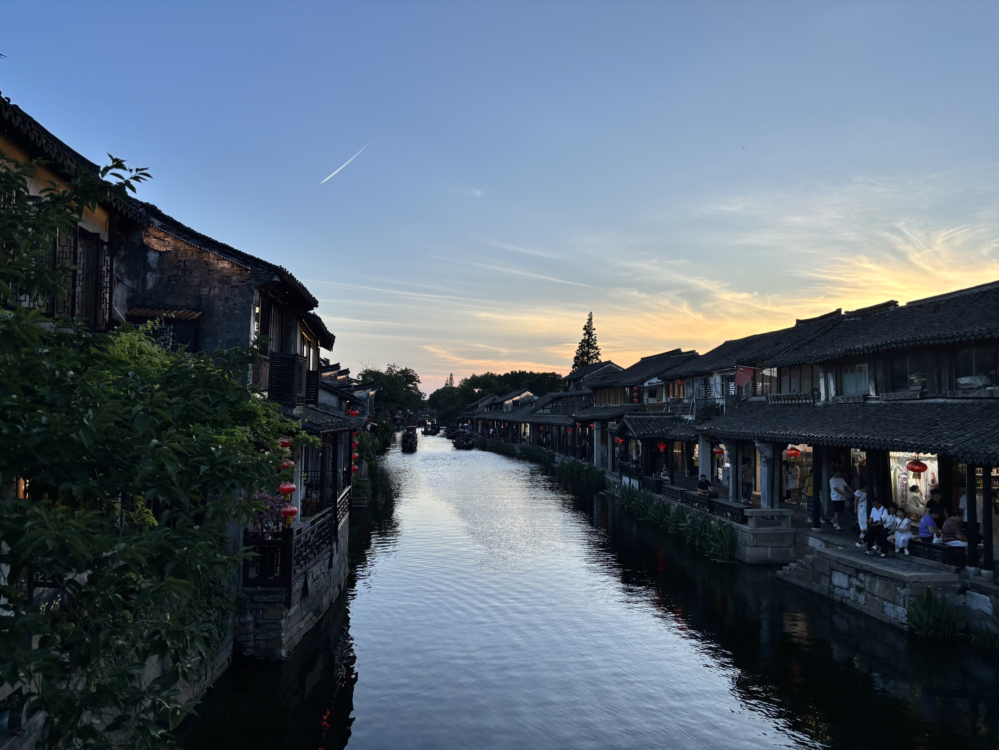
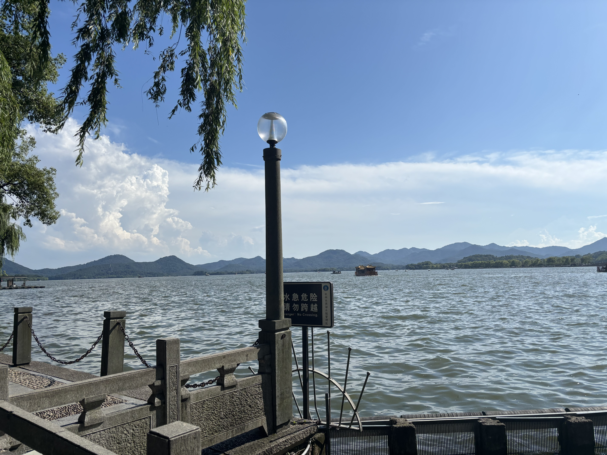
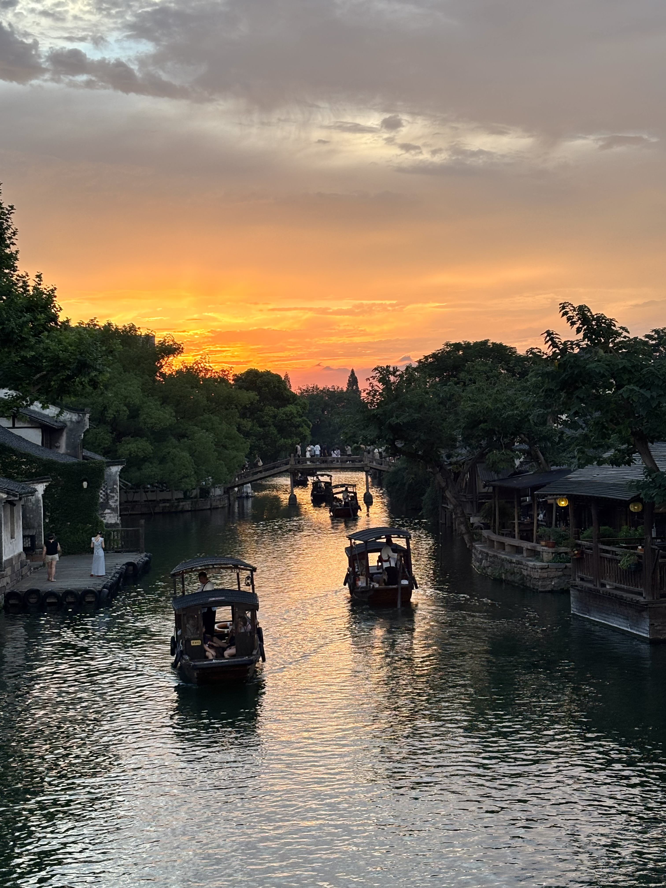

# Luke Yin's Website
## China
### Hangzhou and Suzhou
Hangzhou and Suzhou are cities in Eastern China, in very close proximity with Shanghai. They are both some of the most historical cities in China with hundreds of locations of Ancient buildings, canals, and places of history. During my last trip to China, these two cities were the ones I found most interesting to learn about.

**Facts about Hangzhou**
- Hangzhou is one of China's seven ancient capitals and was the capital of China during the Southern Song Dynasty
- One of the most renowned attractions in Hangzhou is the Xihu lake(picture below) which is a UNESCO World Heritage Site
- Hangzhou has been a major historical silk production hub and includes one of the largest silk museums in the world
- Marco Polo described the city during his visit as the finest and most noble city in the world
- Another UNESCO World Heritage Site, the Grand Canal, also runs through the city

**Facts about Suzhou**
- Suzhou is known for being the "Venice of the East" as it has vast networks of canals flowing throughout the city
- The city is also along the UNESCO World Heritage Site of the Grand Canal
- Suzhou is nearly 2500 years old, being founded during the state of Wu in 514 BC
- 

**Bold** and _Italic_ and `Code` text

[More on Hangzhou](https://www.britannica.com/place/Hangzhou) 
[More on Suzhou](https://www.britannica.com/place/Suzhou)and 

